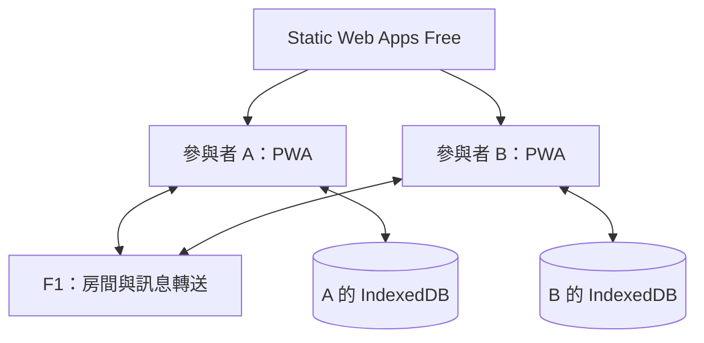

# Flowa 開發計畫

## 1. 定位與已確認決策

Flowa 源自 FlowCanvas（Flow + Canvas），代表在畫布上共同討論流程。產品為跨桌面、平板與觸控筆的多人白板 PWA。

本版取代原先雲端平台型規劃：以本機儲存優先、前端完成大部分工作，僅以免費後端支援短期協作房間。實作進度以 [DEVELOPMENT.md](./DEVELOPMENT.md) 為準；已有單人原型與元素同步 PoC，尚未部署。下列驗收條件保留為完整 MVP 的目標。

- 自有原始碼採 MIT License；初始化儲存庫時建立 LICENSE，確認著作權人與年份。
- 畫布改用 Excalidraw；不使用 tldraw 作為 MVP 相依。
- 前端部署至 Azure Static Web Apps Free。
- 唯一動態後端為 Azure App Service F1 上的輕量轉送服務。
- IndexedDB 為主要持久化位置，JSON 匯出為使用者可攜備份。
- 不使用 PostgreSQL、Redis、Blob Storage、獨立 ASP.NET Core API、付費監控或付費即時服務。
- 暫不採 WebRTC、Signaling、STUN／TURN，以免增加連線與維護複雜度。
- 先驗證 2～4 名同時在線參與者，不沿用原 20 人與 50 人壓力測試目標。
- 不承諾雲端備份、99.5% 可用性、RPO 或 RTO。

## 2. MVP 範圍

- 無限畫布的平移、縮放與框選操作
- 自由繪圖、文字、基本圖形、連接線與箭頭
- 可變更文字及圖形的顏色
- 流程圖節點的快速建立與連接
- 多人即時共同編輯與遠端游標
- 參與者名稱、顏色與連線狀態
- 分享連結與訪客加入
- 畫布自動儲存與重新連線同步
- PNG、SVG 或 JSON 匯出
- PWA 安裝、基本離線開啟與本機草稿
- 桌面、平板與觸控筆操作

補充：為支援可恢復備份，JSON 匯入／匯出列為必要；PNG、SVG 於前端輸出。便條紙、投票、附件、帳號系統、工作區、企業 SSO、留言、版本歷史、AI、視訊、範本與完整畫布管理不列入 MVP。既有套件附帶功能不必刻意移除，但不因而新增服務或驗收承諾。

## 3. 成本與部署邊界

官方資料查核日期：2026-09-22；實際部署前再次確認，免費方案並非無限資源。

| 資源 | 選擇 | 限制與設計影響 |
| --- | --- | --- |
| 前端靜態託管 | Static Web Apps Free | 每月包含 100 GB 流量；前端檔案不由 F1 提供 |
| 房間轉送 | App Service F1，單執行個體 | Windows／Linux 每個執行個體最多 5 條同時 WebSocket |
| CPU | F1 | 每日 60 CPU 分鐘；每 5 分鐘亦有 3 CPU 分鐘配額 |
| F1 出站流量 | 官方表列 165 MB；依 Portal 監控日配額 | 所有房間廣播合計；節流並避免反覆傳整張畫布 |
| 可用性 | 無 Always On、無 SLA | 接受冷啟動、休眠、重啟及限額停用 |
| 雲端永久儲存 | 不啟用 | 不將 F1 檔案系統當作正式畫布資料庫 |
| 診斷 | 瀏覽器、限量主控台紀錄與平台配額監看 | 不預設開通 Application Insights／Log Analytics 等額外資源 |

容量策略：應用程式預設最多接納 4 個已驗證協作連線（全部房間合計），為重連與平台限制保留餘裕；剩餘 1 條並非可靠保證。每分頁最多 1 條協作連線，Viewer 也計入。未驗證連線短時限關閉。應用程式達上限時回傳容量錯誤；若平台先拒絕握手，用戶端改顯示一般服務不可用提示，不保證能辨識平台拒絕原因。

成本控制：

- 部署檢查只允許 Static Web Apps Free 與 App Service F1，不自動升級或新增付費資源。
- 不建立額外付費 Staging 環境；先使用本機測試與可用免費預覽。
- 監看 CPU、出站流量、連線與建置用量；CI/CD 額度也須核對。
- 設定預算通知，但明確指出預算警示不是硬性停費機制。
- 超出容量時保留本機模式，不以切換付費服務當作自動降級方案。
- 零服務費以資源維持免費方案及額度內為前提，不包含人力與另購網域。

## 4. 架構與責任

| 元件 | 技術 | 責任 |
| --- | --- | --- |
| apps/web | React、TypeScript、Vite、Excalidraw | 編輯、顏色、流程節點、匯出、同步 adapter |
| 本機資料 | IndexedDB | 文件、版本資訊、刪除標記、未同步操作及偏好 |
| PWA | Manifest、Service Worker | 殼層與字型快取、安裝、更新提示 |
| apps/relay | Node.js／TypeScript、Socket.IO | 短期房間、連線資格、廣播、Presence |
| packages/protocol | 共用型別與 schema | 協定版本、訊息驗證、限制與錯誤碼 |

後端優先參考官方 excalidraw-room；不能假設原範例已提供本計畫的權限、配額與復原能力。Excalidraw 元件不附完整協作實作，整合工作必須納入估時。

不同時維護 .NET API 與 Node.js 同步服務。此版本選擇單一 Node.js 轉送服務以便重用官方範例；若 PoC 證實不適合，先記錄 ADR 再評估替換，不能默默加入第二個後端。

前端直接連至 F1 的 WSS 端點；不依賴 Static Web Apps Free 的自訂 API 代理。靜態路由使用 SPA fallback，確保分享網址可直接開啟。後端沒有資料庫或永久快照。

## 5. 儲存與恢復語意

| 情境 | 行為 |
| --- | --- |
| 單人建立／編輯 | 立即繪製，節流寫入 IndexedDB；只有交易成功才能顯示已存於此裝置 |
| 後端不可用 | 仍可使用已載入或已快取的單人畫布與匯出 |
| 新訪客加入 | 由已驗證的在線參與者提供初始狀態，再合併後續更新 |
| 短暫斷線 | 本機保存可恢復編輯；房間仍有效時重新驗證並合併 |
| 全員離開 | 空房間短期逾時清除；不保證之後可由伺服器取回資料 |
| 後端重啟或房間逾時 | 舊房間失效；保留本機副本，明確提示重新開房並分享新連結 |
| 全員離線後各自編輯 | 不承諾跨已失效房間自動合併；選定副本重新開房，其他分歧副本先匯出備份 |
| 新裝置使用舊連結 | 若無有效房間與在線副本，顯示無法取得內容，不建立空白畫布冒充原文件 |
| 瀏覽器清除資料／裝置遺失 | 需其他參與者副本或 JSON；沒有副本即無法保證復原 |

本機持久化與共同編輯不是同一件事。UI 分別顯示「儲存中／已存於此裝置／儲存失敗」與「離線／連線中／等待初始內容／同步中／同步完成／房間失效」。

同步完成代表在線同步協定完成，並非雲端持久化成功。不得使用「已備份到雲端」等誤導訊息。

IndexedDB 仍可能遭清除、配額不足或瀏覽器回收。提供 JSON 匯出、備份提示與儲存錯誤處理；可嘗試請求 persistent storage，但不得假設瀏覽器一定核准。

## 6. 編輯與同步設計

### 6.1 畫布功能

- 平移、縮放、框選、自由筆、文字、基本形狀、連線與箭頭。
- 文字顏色、圖形外框與填色；顏色要能同步、儲存與匯出。
- 快速建立流程節點、吸附連接；移動節點時維持連線關係。
- 複製、刪除、快捷鍵、個人 Undo／Redo；不得以整份歷史快照抹除他人變更。
- PNG、SVG 與版本化 JSON 在瀏覽器產生；字型須可離線載入。
- 觸控手勢與觸控筆分流；不承諾所有硬體皆有相同壓感能力。

### 6.2 同步協定

Phase 0 優先評估與固定版本 Excalidraw 官方協作一致的 element reconciliation；不得直接將整張 JSON 以最後寫入者覆蓋。若需非公開 API，須評估更新風險並封裝於 adapter，不假設內部函式穩定。

必要規則：

- 以穩定 element id、版本資訊及確定性衝突規則合併，保留刪除標記。
- 同步文字、位置、樣式、連接關係與排序；同一物件並行編輯的勝出規則須文件化。最終一致不代表可保留所有同時輸入內容。
- 去除重複訊息、辨識本機／遠端來源，避免接收後再次廣播形成迴圈。
- 初始狀態傳輸期間緩衝增量；完成合併後才開放共同編輯。
- 同一房間重連時先備份本機狀態，再交換資料、合併與確認，測試刪除／修改並行情境。
- Presence 與文件分離；游標過時即可丟棄，不寫入文件歷史。
- 游標先以每秒最多 5 次、文件更新批次以每 100～200 ms 為可調起點，依實測流量修正。
- 只傳變更；完整狀態限加入與必要重同步使用。定義訊息／畫布大小限制，不無限制排隊。
- Socket.IO 明確使用 WebSocket transport，MVP 不以無限制 long polling 繞過容量限制。
- 不引入 Yjs 作為第二套權威狀態；若原生合併不可行，先完成替代方案 ADR 與 PoC，再修改計畫。

## 7. 訪客與房間安全

MVP 不建立永久帳號、工作區或雲端成員表。

| 角色 | 憑證與能力 |
| --- | --- |
| 房間建立者 | 持有管理憑證，可關閉當次房間與產生分享連結 |
| 編輯訪客 | 持有編輯憑證，可接收／傳送畫布更新 |
| 檢視訪客 | 持有唯讀憑證，只可接收內容與傳送有限 Presence |

顯示名稱不是已驗證身分。憑證採密碼學安全亂數（至少 128-bit 熵），不同角色使用不同憑證，不信任用戶端傳入的 role。

- 憑證放在網址 fragment，由前端取得後送至 WSS 驗證；不放 query、分析事件或 Log。
- 伺服器僅於記憶體保存憑證雜湊、到期與房間成員，逐次驗證訊息所屬房間和角色。
- 預設建議房間最長 8 小時、空房間閒置 10 分鐘清除，數值在 PoC 後調整。
- 關閉／逾時／重啟後原連結失效。禁止訪客用已不存在的 room id 自動重建舊房間；必須重新開房取得新憑證。
- 被踢除或失效的訪客仍可能保有已收到的本機副本；不能遠端撤回既有資料。
- HTTPS／WSS 保護傳輸，但不等於端對端加密。未完成加密設計與測試前，不宣稱服務端無法讀取內容。
- 設定 Origin allowlist、速率限制、訊息 schema／長度驗證、CSP、輸入清理及輸出編碼。
- 本機刪除只影響目前裝置，不會刪除其他參與者的副本。

## 8. 資料與介面草案

### 本機 IndexedDB

| 記錄 | 主要內容 |
| --- | --- |
| LocalBoard | localBoardId、title、schemaVersion、elements、updatedAt |
| SyncRecovery | 房間識別、協定版本、未完成操作、刪除標記與同步資訊 |
| Preferences | 顯示名稱、游標顏色、工具偏好 |
| RecoveryCopy | migration 或重連前的可恢復副本，設數量與大小上限 |

不將 view transform、游標等暫時資料混入共享文件。持久化記錄包含 schemaVersion，匯入必須驗證大小、欄位與相容性；資料 migration 失敗保留原副本。

### 後端記憶體

RoomSession：roomId、expiresAt、角色憑證雜湊、成員、速率計數及有界的短期訊息緩衝。沒有 User／Workspace／Asset／BoardSnapshot 資料表，不保證快取內容在重啟後存在。

### 介面

- GET /healthz：簡單健康檢查，不輸出房間或憑證資訊。
- POST /rooms：建立限時房間與角色憑證；有配額與濫用限制。
- DELETE /rooms/{roomId}：驗證管理憑證後關閉房間。
- Socket.IO /socket.io/：驗證、加入、初始同步、增量、Presence 與錯誤事件。

事件草案：join、joined、snapshot-request、snapshot-response、elements-update、presence、sync-ack、room-closed、error。最終封包結構於 PoC 固定版本，不宣稱與官方房間服務完全相容。

錯誤包括 capacity-exceeded、unauthorized、room-expired、payload-too-large、protocol-mismatch。無資料不得回覆空白場景當作成功同步。

## 9. 開發階段

以下時程以一名熟悉 TypeScript 的開發者為估算假設，合計約 6～10 週；不是承諾，PoC 後重估。

| 階段 | 估計 | 交付與完成條件 |
| --- | --- | --- |
| Phase 0：PoC | 1～2 週 | Excalidraw、兩人同步、顏色／刪除衝突、Undo、F1 握手與配額、IndexedDB、離線重連；產出 Canvas／Sync／儲存 ADR |
| Phase 1：單人 PWA | 1～2 週 | 核心工具、節點連接、顏色、IndexedDB、JSON 備份還原、PNG／SVG、PWA；不連後端也可完成流程圖 |
| Phase 2：房間協作 | 2～3 週 | 2～4 人、訪客憑證、唯讀阻擋、Presence、初始狀態與重連合併、容量提示；30 分鐘協作量測通過 |
| Phase 3：免費部署與 Beta | 2～3 週 | 跨裝置、配額／冷啟動／重啟測試、本機備份還原、安全檢查、文件、僅免費資源部署與回滾 |

Phase 0 停止條件：合併或 Undo 會破壞資料、免費配額不足以完成基本測試、或套件條件不符。先報告取捨並調整範圍，不自行新增付費資源。

## 10. 驗收與測試

### 功能

- 同一瀏覽器重新開啟後能讀取成功儲存的本機畫布。
- 文字、圖形、顏色及流程連接在多人操作後依規則收斂。
- 在同房間仍有效且有可用副本的條件下，斷線重連不以舊快照覆蓋遠端。
- 測試並行新增、修改、刪除、排序、文字與 Undo；保留明確且可重現的衝突規則。
- Viewer 直接送寫入封包也被伺服器拒絕；錯房間或錯憑證不能收到內容。
- 後端重啟或房間清除後顯示失效，保留本機副本並可重新開房。
- JSON 在乾淨瀏覽器可還原；PNG／SVG 顯示正確文字與顏色。
- 本機儲存不足／失敗不能顯示儲存成功；提供匯出操作。
- 協作後端不可用時，已快取的前端仍可離線編輯與匯出。
- 有未保存變更時不自動套用 Service Worker 更新；升級前備份並執行 migration。

### 量測目標

| 項目 | 目標或限制 |
| --- | --- |
| 協作人數 | 全服務 2～4 個連線；測試第五／第六個連線與多房間總量限制 |
| 測試時長 | 2 人與 4 人各至少一次連續 30 分鐘，量測 CPU、流量及重連 |
| 同步延遲 | 暖機、一般網路下 p95 < 500 ms 為初始目標，不含冷啟動與停用期間 |
| 畫布規模 | 500 個物件為基線、2,000 個為壓力測試；依 iPad 實測調整 |
| 本機儲存 | 正常情況停止操作後 2 秒內完成 IndexedDB 寫入；以交易結果為準 |
| 服務可用性 | 不訂雲端 SLA；配額耗盡時協作不可用但可保留本機模式 |
| 資料恢復 | 僅驗證本機副本／JSON 恢復，不設雲端 RPO／RTO |

流量測量必須包含廣播扇出、游標、初始化與重連。例如每人每秒 5 個 200-byte 游標訊息、4 人互傳，轉送約 12 KB/s，30 分鐘約 21.6 MB（未含協定開銷與文件）。此為估算，不是實测配額保證；超標時降低游標頻率及封包大小。

測試組合：單元與 schema 測試、同步亂序／重複／收斂測試、多 Browser Context E2E、Chromium／Firefox／Safari 與實體 iPad／觸控筆。模擬後端全失憶、全員離線、資料被清除、版本不相容與惡意大封包。

## 11. PWA、CI/CD 與維運

- Manifest、圖示、必要字型及殼層快取；安裝流程依瀏覽器呈現。
- iPad 背景／鎖屏可能中斷連線；恢復前景後重新驗證房間，不依賴背景常駐同步。
- 不快取帶憑證的房間管理回應；私密文件放 IndexedDB，不混入公共靜態快取。
- PR 執行 lint、typecheck、單元、同步測試及 build；以本機 relay 執行大部分 CI E2E，避免耗用 F1。
- Web 與 relay 使用協定版本；不相容時提示升級而非套用錯誤格式。
- 部署前核對 Free／F1 SKU、區域、執行環境與免費建置額度。生產部署不自動變更資費。
- 保留先前靜態 artifact 與 relay 版本以利回滾，不假設 F1 有 deployment slots。
- 日誌不含文件、分享憑證或識別個人的內容，設量與保留上限。
- Runbook 包含配額耗盡、冷啟動、房間失效、匯出還原與前端版本更新。
- 發布前再次確認套件授權與固定版本的第三方聲明。

## 12. 主要風險與處理

| 風險 | 處理 |
| --- | --- |
| F1 連線／CPU／流量不足 | 2～4 人、全服務容量控制、增量與節流、本機降級 |
| 免費服務停止或規則變更 | 部署前核對；保留靜態單人功能與可攜 JSON，不自動付費 |
| 瀏覽器資料被清除 | 告知非雲端備份、提供匯出及副本恢復 |
| 協作合併錯誤 | Phase 0 收斂測試、刪除標記、備份、版本化 adapter |
| 後端房間遺失 | 舊連結失效、持有副本者重新開房，不冒充恢復成功 |
| 公開分享遭濫用 | 高熵憑證、Origin 驗證、限量、短時驗證與逾時清除 |
| SDK 升級影響內部 API | 鎖定版本、獨立 adapter、契約與回歸測試 |
| 誤開付費資源 | 部署 SKU 檢查、清單審查、預算通知與人工核准 |

## 13. 待實作確認與完成定義

已定案：MIT、Excalidraw、IndexedDB、免費靜態託管＋F1 relay、無永久帳號與雲端資料庫、2～4 人目標。

PoC 待確認：Excalidraw 精確版本、同步與 Undo adapter、F1 runtime／區域、畫布與封包大小、房間期限、最低瀏覽器版本。

MVP 完成須滿足：

- 使用者列出的功能及本文件限制均有對應測試。
- 2～4 人、唯讀權限、重連、房間失效、離線及匯出還原測試通過。
- 免費資源清單、實測 CPU／流量報告與無自動升級檢查完成。
- 無未處理的 P0／P1 缺陷；MIT LICENSE 與第三方聲明到位。
- README 有真實啟動方式、服務不可用提示與資料保存限制。
- 單人模式不依賴後端；多人模式不宣稱永久保存或企業可用性。

## 14. 後續版本（另行確認範圍與成本）

便條紙、投票、範本、留言、附件、完整畫布管理、群組與圖層功能、版本歷史、Mermaid／UML、AI 整理、企業整合與 SSO。永久雲端文件、跨裝置自動恢復與更多協作者需重新評估儲存、配額及預算，不能當作免費 MVP 已具備的能力。

## 15. 官方參考資料

- [Azure App Service 配額表](https://github.com/MicrosoftDocs/azure-docs/blob/main/includes/azure-websites-limits.md)：F1 WebSocket、CPU、流量、Always On 與 SLA。
- [App Service 配額與監看](https://learn.microsoft.com/en-us/azure/app-service/web-sites-monitor)：每日配額及用量監看。
- [Static Web Apps 配額](https://learn.microsoft.com/en-us/azure/static-web-apps/quotas)：免費靜態託管流量。
- [Excalidraw 原始碼與授權](https://github.com/excalidraw/excalidraw)：版本、功能與 MIT。
- [Excalidraw 協作 FAQ](https://docs.excalidraw.com/docs/@excalidraw/excalidraw/faq)：元件不含完整協作。
- [官方 excalidraw-room](https://github.com/excalidraw/excalidraw-room)：轉送服務參考。

以上為設計依據，不代表目前已部署、測試通過或保證日後配額不變。
